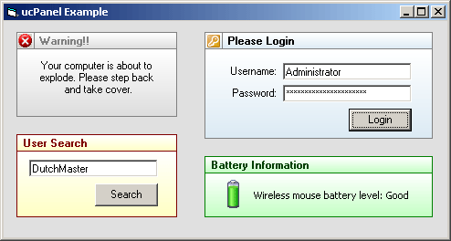



## A1: My ucPanel Control

### Description

This is a custom Frame (Panel) control. It is VERY simple and VERY lightweight. I used the Fast Gradient code from Carles P.V. + Light Templer to generate the background gradients (Excellent code guys - VERY fast). Also I allowed the panel's Picture to be resized to fit in the header properly. Font, Font Color, Border Color, etc.. All included. I am working on making the image transparent.. Stay tuned.
 
### More Info
 

             |
---                |---
**Submitted On**   |2005-02-03 10:41:02
**By**             |[\[\]\)utch\[\]v\[\]aster](https://github.com/Planet-Source-Code/PSCIndex/blob/master/ByAuthor/utch-v-aster.md)
**Level**          |Intermediate
**User Rating**    |4.6 (79 globes from 17 users)
**Compatibility**  |VB 5\.0, VB 6\.0
**Category**       |[Custom Controls/ Forms/  Menus](https://github.com/Planet-Source-Code/PSCIndex/blob/master/ByCategory/custom-controls-forms-menus__1-4.md)
**World**          |[Visual Basic](https://github.com/Planet-Source-Code/PSCIndex/blob/master/ByWorld/visual-basic.md)
**Archive File**   |[A1\_\_My\_ucP184779232005\.zip](https://github.com/Planet-Source-Code/utch-v-aster-a1-my-ucpanel-control__1-58670/archive/master.zip)

